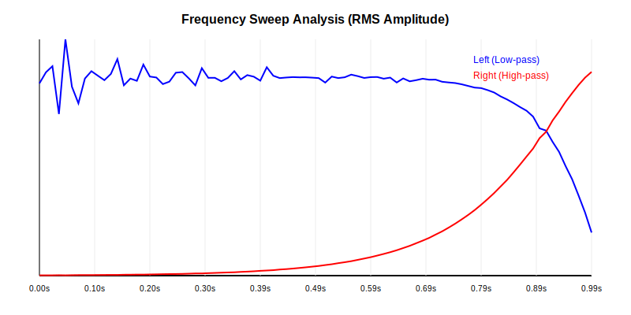
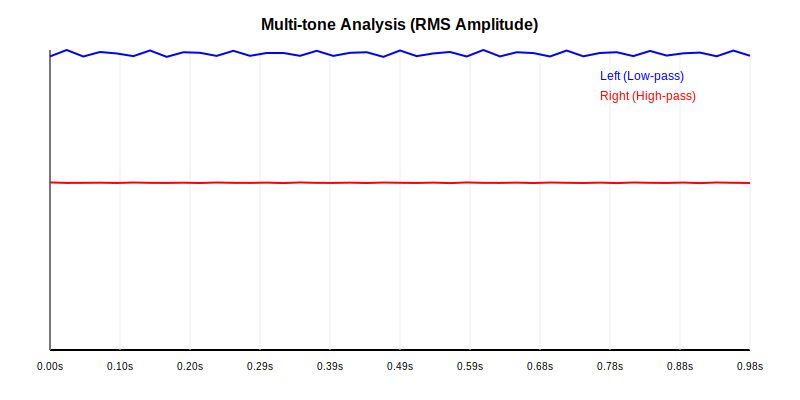

# QMF Filter Implementation using LFSR

This project provides a complete implementation of a Quadrature Mirror Filter (QMF) system. It includes:
- A 64-bit bidirectional Linear Feedback Shift Register (LFSR) for pseudo-random sequence generation.
- An iterative algorithm to generate orthogonal Daubechies-like filter coefficients.
- Spectral warping for adjustable split frequencies (`daub_shift`).
- QMF Analysis (downsampling) and Synthesis (upsampling) banks.
- A real-time audio processing demo with mock audio hardware simulation.

## Filter Characteristics

The filter is designed for a 2-band frequency split (low-pass and high-pass). The orthogonality of the coefficients ensures that the signal can be reconstructed with minimal error after splitting and recombining.

### Frequency Response (Magnitude and Phase)
The following plot shows the frequency response of the analysis bank.
- **Low-pass filter (Blue)**: Captures frequencies from 0 to 0.25 (normalized).
- **High-pass filter (Red)**: Captures frequencies from 0.25 to 0.5.
- **Crossover Region**: The split occurs at f=0.25.
- **Total Power (Green dashed)**: Indicates how well the filters sum to a flat response, which is a requirement for perfect reconstruction.


### Signal Reconstruction
This plot compares a complex original signal (sum of sine waves) with its reconstructed version after passing through the QMF analysis and synthesis banks.
- **Original (Faded Green)**: Input signal.
- **Reconstructed (Purple dashed)**: Signal after analysis, downsampling, upsampling, and synthesis.
- *Note: A delay of N-1 samples is inherent in the system and corrected for visualization.*


## Mock Audio Hardware Simulation

To verify the real-time processing capabilities, the project includes a mock audio hardware simulation system.

### Frequency Sweep Analysis
The following plot shows the RMS amplitude of the split output (Low-pass Left, High-pass Right) for a logarithmic frequency sweep from 20Hz to 20kHz.
- **Left (Blue)**: Low-pass output dominates at low frequencies and rolls off as the sweep crosses the split point.
- **Right (Red)**: High-pass output increases as the sweep enters the higher frequency range.



### Multi-tone Analysis
The multi-tone analysis evaluates the filter's behavior when multiple frequencies (e.g., 440Hz, 1000Hz, 5000Hz, 15000Hz) are processed simultaneously.



## Building and Running

### Prerequisites
- GCC (or any standard C compiler)
- Python 3 (for signal generation and visualization)

### Compile
To build all components (tests, data generator, audio demo):
```bash
make
```

### Run Tests and Visualizations
To run the comprehensive test suite and generate all plots (including mock audio simulation):
```bash
./run_mock_test.sh
```

## Project Structure
- `qmf.h` / `qmf.c`: Core library (LFSR, Daubechies, QMF).
- `audio_demo.c`: Real-time audio processing simulation.
- `mock_audio_gen.py`: Mock signal generator.
- `mock_audio_analyzer.py`: Mock output analyzer.
- `mock_audio_visualizer.py`: SVG plot generator for mock analysis.
- `gen_data.c`: Generates CSV data for spectral evaluation.
- `visualize.py`: Python script to convert spectral CSV data to SVG plots.
- `comprehensive_test.c`: Advanced tests for orthogonality and reconstruction accuracy.
- `Makefile`: Unified build system.
