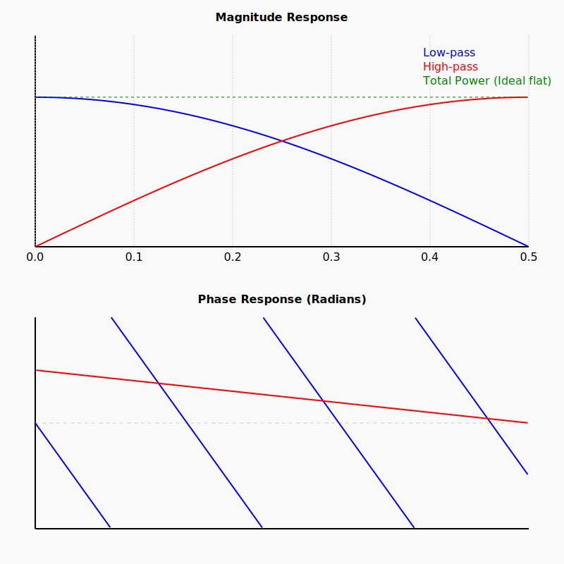
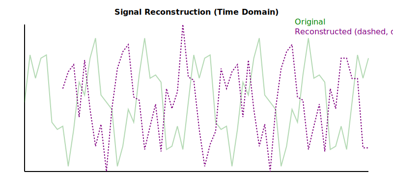

# QMF Filter Implementation using LFSR

This project provides a complete implementation of a Quadrature Mirror Filter (QMF) system. It includes:
- A 64-bit bidirectional Linear Feedback Shift Register (LFSR) for pseudo-random sequence generation.
- An iterative algorithm to generate orthogonal Daubechies-like filter coefficients.
- QMF Analysis (downsampling) and Synthesis (upsampling) banks.

## Filter Characteristics

The filter is designed for a 2-band frequency split (low-pass and high-pass). The orthogonality of the coefficients ensures that the signal can be reconstructed with minimal error after splitting and recombining.

### Frequency Response (Magnitude and Phase)
The following plot shows the frequency response of the analysis bank.
- **Low-pass filter (Blue)**: Captures frequencies from 0 to 0.25 (normalized).
- **High-pass filter (Red)**: Captures frequencies from 0.25 to 0.5.
- **Crossover Region**: The split occurs at f=0.25.
- **Total Power (Green dashed)**: Indicates how well the filters sum to a flat response, which is a requirement for perfect reconstruction.



### Signal Reconstruction
This plot compares a complex original signal (sum of sine waves) with its reconstructed version after passing through the QMF analysis and synthesis banks.
- **Original (Faded Green)**: Input signal.
- **Reconstructed (Purple dashed)**: Signal after analysis, downsampling, upsampling, and synthesis.
- *Note: A delay of N-1 samples is inherent in the system and corrected for visualization.*



## Building and Running

### Prerequisites
- GCC (or any standard C compiler)
- Python 3 (for visualization)

### Compile
To build all components (tests, data generator):
```bash
make
```

### Run Tests
To run the comprehensive test suite:
```bash
./comprehensive_test
```

### Generate Plots
To generate the latest frequency response and reconstruction plots:
```bash
make visualize
```

## Project Structure
- `qmf.h` / `qmf.c`: Core library (LFSR, Daubechies, QMF).
- `gen_data.c`: Generates CSV data for evaluation.
- `visualize.py`: Python script to convert CSV data to SVG plots.
- `test_qmf.c`: Basic integration test.
- `comprehensive_test.c`: Advanced tests for orthogonality and reconstruction accuracy.
- `filter-main.c`: Simple demonstration application.
